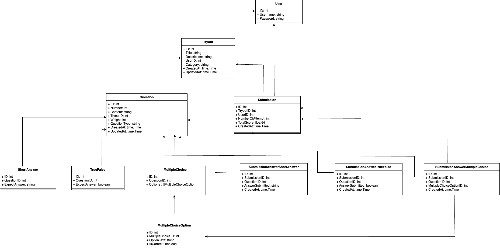

# RISTEK TEST BE Lvl 4 - Cleo Excellen Iskandar✍🏻
## Pre-Requisite 🔌
Before cloning this repository make sure:
1. [Go](https://go.dev/doc/install) is installed
2. [Postgresql](https://www.postgresql.org/download/) is downloaded

## Getting Started ⏰
1. Clone the repo
```bash
git clone https://github.com/cleoexcel/ristek-test.git
cd ristek-test
```

2. Open Postgresql and create schema `ristektest`
3. Copy the content in `.env.sample` to a new `.env` file (Note: adjustment on the content may be needed)
4. Install dependencies
```bash
go mod tidy
```
5. run the project
```bash
go run main.go
```

## Database Schema 🧮

Anda dapat mengakses UML class diagram secara detail melalui [UML Class Diagram](https://drive.google.com/file/d/1BPHj7ASMM-Z0S8Xk1e_Pz4piF7uR2Mbl/view?usp=sharing)

## API Contract ⚖️
Anda dapat mengakses penjelasan secara detail pada setiap routes melalui [swagger](https://app.swaggerhub.com/apis-docs/CleoExcellen/OPREC_RISTEK/1.0.0) atau [postman](https://api-ristek.postman.co/workspace/API-RISTEK-Workspace~c1cb0d07-3c89-45f6-82b9-3202ba8d08b1/collection/38268031-b06bb323-8b25-42d0-8c4d-d884686e69b2?action=share&creator=38268031)

## Demo API
[Demo API](media/postmanpenjelasan.MP4)
Anda dapat mengakses Demo API secara detail melalui [Youtube](https://youtu.be/gDcPSEZQLvk?si=aiRpj07i4zYPRL17)


## Penjelasan 📜
- Pada category tryout hanya terdiri dari Biologi, Physics, Math, Chemistry, dan History.
- User dapat mengedit title dan description tryout, tetapi tidak dapat mengedit category.
- User dapat mengedit content, weight, expectanswer yang mereka telah buat untuk suatu question, tetapi tidak dapat mengedit question_type.
- User dapat menjawab/mensubmit tryout dan mendapatkan score berdasarkan bobot(weight) yang diberikan pada setiap question.

## Alur 👣
1. User mendaftar akunnya dengan memberikan username dan password. 
2. User melakukan login ke akun mereka.
3. User membuat tryout mereka.
4. User melihat tryout-tryout dari user lain dan tryout mereka sendiri
5. User mengedit judul dan description tryout mereka sendiri.
6. User membuat/mengedit/mendelete question sebelum ada yang melakukan submisi pada tryout mereka
7. User melakukan banyak submisi pada satu tryout (optional)
8. User akan mendapatkan score pada setiap submisi yang mereka lakukan
